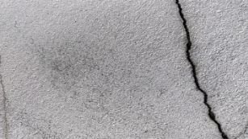
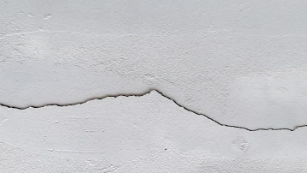
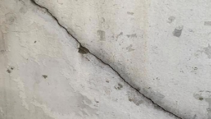
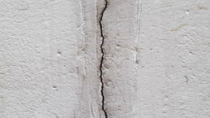
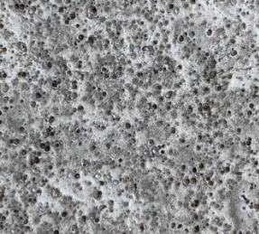
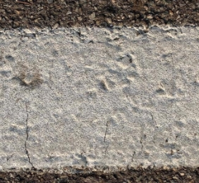
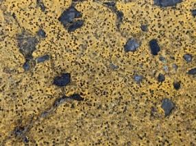
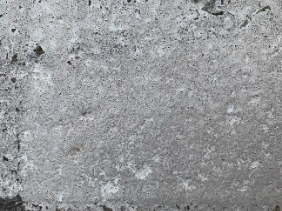
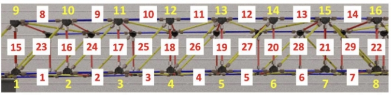

**Final Project** 

Due by December 17th 

- Carefully read the problem set and instructions. Select one of the problems below as a team (teams are arranged in page 4).  
- Request dataset (or supporting materials) if you chose Problem set 2 or 3. (email request [robinekim@snu.ac.kr )](mailto:robinekim@snu.ac.kr)  
- Submit a full report on the problem set your team chose 
- In any of the problem set, submit your codes as well 
- No direct use of chat-gpt, git-hub codes are allowed.  

**Problem 1. – Crack detection and segmentation** 

- Download crack images from AI-hub (aihub.or.kr). Four example images are shown below.  
- Develop a pre-processing algorithm that filters noises such that your code can **well** detect cracks.  
- In your report, include discussions about the **filtering algorithm**, **chosen parameters, segmentation,** and **quantitative assessment** on your detecting algorithm performance.  
- Your code should be tested for at least 30 images 
  - Evaluate your detection/segmentation  
- Optional: Compare your results with AI model uploaded in the database 

◼  You can alternatively develop your own machine learning model, but your report should discuss about pre- processing and detailed algorithm regarding (Reusing ai-hub model will not be considered) 

 

 

[https://aihub.or.kr/aihubdata/data/view.do?currMenu=115&topMenu=100&aihubDataSe=realm&dataSetSn=162 ](https://aihub.or.kr/aihubdata/data/view.do?currMenu=115&topMenu=100&aihubDataSe=realm&dataSetSn=162)

**Problem 2. - Hough Transform**  

- Request glass-beads images (note that files are prohibited from using for other purpose than this project)  
  - Sample of images are shown below  
- Develop an algorithm that detects beads on the road marking.  
  - Your algorithm should include preprocessing of the image to handle different colors of the marking  
- Evaluate the performance of the algorithm for at least 5 images (discuss using confusion matrix etc.)  

 

 

**Problem 3. – Tracking [Codes shared from IC-SHM2022]**  

Perform two-dimensional tracking for simulated response of the structure; Use undamaged video. Assume that the structure plane is parallel to the image plane and the video is taken in 120 fps.  

- Choose at least four nodes of the truss structure. Refer to the Node id are shown in the figure below:  
- Plot vertical displacement of the nodes in terms of pixels.  
- Apply the developed tracking algorithm to a damaged vides 
- Evaluate the pixel displacement and evaluate any difference noticed 
- Optional1: change pixel unit into SI unit knowing that the one bay is 0.3937 m (i.e. the length of the horizontal member) 
- Optional2: Compare your results with ground truth.  

