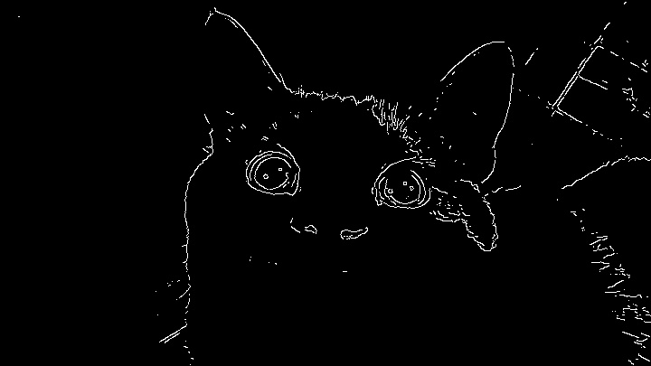
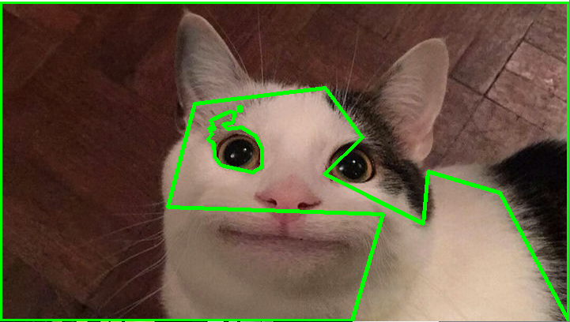

# Canny Detection

*Canny detection code for SNU DAAE ICT final project*

## Introduction

Final project for the Seoul National University Departmepartment of Architecture & Architectural Engineering ICT-Based Smar Architecture(001).

Crack detecting using canny edge detection.

## Requirement

```bash
pip install -r requirement.txt
```

## Quick Start

Change working directory to `Canny` repository.

```bash
cd Canny
```

Run `__main__.py`.

```bash
python .
```

## Results

Test image of `scr/data/test/smile_cat.jpg`.

| Original | Edge Detecting |
| :--: | :--: |
|  |  |

| Approx | Contour |
| :--: | :--: |
|  |  |

## Citation

```
@article{Final Project - Canny Detection | SNU DAAE ICT-Based Smart Architecture,
  author = {Byunghee},
  month = {12},
  title = {{Final Project - Canny Detection}},
  year = {2023}
}
```

---

[B.H.Yoo](mailto:pikaybh@snu.ac.kr)

<p style="color:grey">Seoul National University Construction & Management Lab.</p>